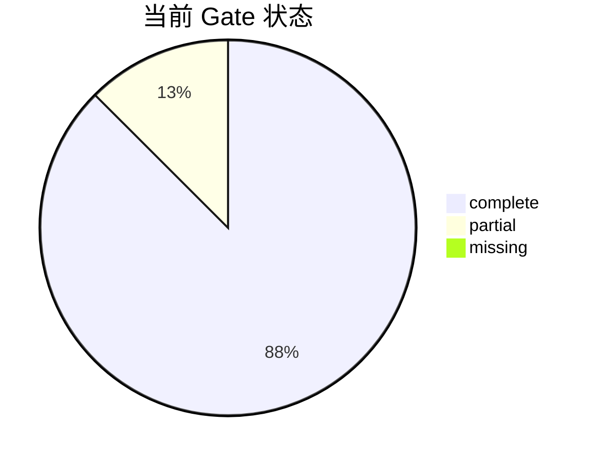
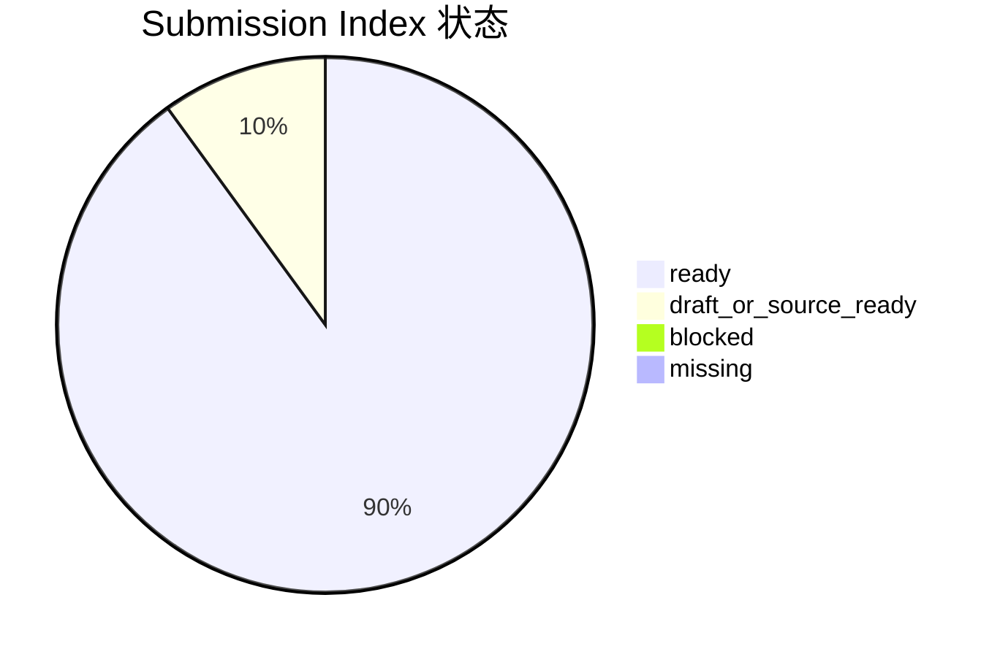
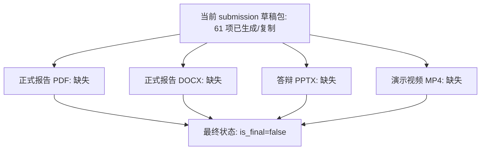

# 阶段进展汇报：赛题完成度与下一步

汇报时间：2026-05-29 01:31:35 +08:00  
汇报对象：导师/组会快速阅读版  
阶段标记：`M-20260529-0131`

## 一句话结论

项目已完成主体技术链路和提交草稿结构，CST Level 1 required 与 Level 2 full48 识别链路均已有可核验产物；当前尚未达到最终提交状态，唯一关键阻塞门为 `G5`，即最终报告 PDF/DOCX、答辩 PPTX、演示视频 MP4 仍未生成，并需处理 Level 1 精度风险与结构散射/遮挡对照证据。

## 本阶段做了什么

| 模块 | 当前进展 | 证据入口 |
|---|---|---|
| 文献与方案 | 已形成文献矩阵、技术路线、报告草稿和赛题要求矩阵 | `docs/literature_matrix.md`, `docs/solution_report_draft.md`, `outputs/problem_requirements/problem_requirements_matrix.md` |
| 测量布局 | 已固定 2π 上半球测量面，162 个半球面测点 | `outputs/cst_templates/sensor_layout_hemisphere_for_cst.csv` |
| Level 1 CST | required 标准源链路已完成，当前 required-now 缺失文件为 0 | `outputs/cst_level1_merge_report/level1_merge_summary.json`, `outputs/cst_level1_reconstruction_batch` |
| Level 2 CST | 48/48 个 CST-derived element-library 样本完整，识别 accuracy 为 1.000 | `outputs/cst_level2_merge_report/level2_merge_summary.json`, `outputs/cst_recognition_level2/cst_recognition_metrics.json` |
| 项目审计 | 已生成 scorecard、completion audit、master dashboard、submission index | `outputs/scorecard/scorecard.md`, `outputs/completion_audit/completion_audit.md`, `outputs/master_dashboard/master_status_dashboard.md` |
| 提交草稿 | 当前 submission 草稿包 61 项已复制或生成，缺失源文件为 0 | `submission/`, `submission/submission_draft_summary.json` |

## 完成度图表

### Gate 状态分布

### 主线流程状态

### 提交物状态分布

### 最终交付物缺口

## 当前产物

| 产物 | 路径 | 导师可看点 |
|---|---|---|
| 总控状态看板 | `outputs/master_dashboard/master_status_dashboard.md` | 一页看清当前 gate、阻塞点和三人任务队列 |
| 完成度审计 | `outputs/completion_audit/completion_audit.md` | 保守判断哪些 gate 已完成、哪个 gate 未关闭 |
| 赛题要求矩阵 | `outputs/problem_requirements/problem_requirements_matrix.md` | 将赛题要求、评分项和已有证据逐项对齐 |
| 评分证据板 | `outputs/scorecard/scorecard.md` | 支撑报告/PPT 的评分项证据摘要 |
| 提交包索引 | `outputs/submission_index/submission_package_index.md` | 检查报告、代码、数据、CST、附录的提交状态 |
| 草稿提交包 | `submission/` | 当前可预览的最终提交目录结构 |

## 当前风险

| 风险 | 影响 | 建议处理 |
|---|---|---|
| Level 1 solver-safe 重建精度风险 | 影响标准源重建部分的可信度表达 | 优先复核近远场一致性、等效源基函数和正则化；若短期不能显著改善，则形成误差机理说明 |
| Level 2 full48 主要是 element-library 叠加证据 | 复杂载体结构散射/遮挡证据仍偏弱 | 补 1 到 2 个代表样本的简化结构对照，或在报告中明确适用边界 |
| 最终 PDF/DOCX/PPTX/MP4 未生成 | 不能进入最终提交态 | 在指标稳定后集中成稿并导出正式文件 |

## 下一步建议

| 优先级 | 负责人 | 动作 | 关闭证据 |
|---:|---|---|---|
| 1 | A_algorithm | 处理 Level 1 solver-safe 重建精度风险 | 改进后的 `outputs/cst_level1_reconstruction_batch`，或明确误差机理说明 |
| 2 | B_CST | 补充简化载体结构散射/遮挡对照 | `outputs/cst_structure_comparison`，或报告/PPT 中的对照图表 |
| 3 | C_docs | 将 Level 1/2 最新结果写入正式报告、PPT 和视频脚本 | `solution_report.pdf`, `solution_report.docx`, `defense_slides.pptx`, `demo_video.mp4` 存在且指标一致 |
| 4 | C_docs | 最终打包前重建 scorecard、需求矩阵、提交索引和完成度审计 | `completion_proven=true`，且 submission index blocked=0 |

## 本次核验依据

- `outputs/master_dashboard/master_dashboard_summary.json`
- `outputs/completion_audit/completion_audit_summary.json`
- `outputs/submission_index/submission_index_summary.json`
- `submission/submission_draft_summary.json`
- `outputs/master_dashboard/master_gate_summary.csv`
- `outputs/master_dashboard/master_next_actions.csv`
- `submission/01_report`
- `submission/02_presentation`
- `submission/03_video`
