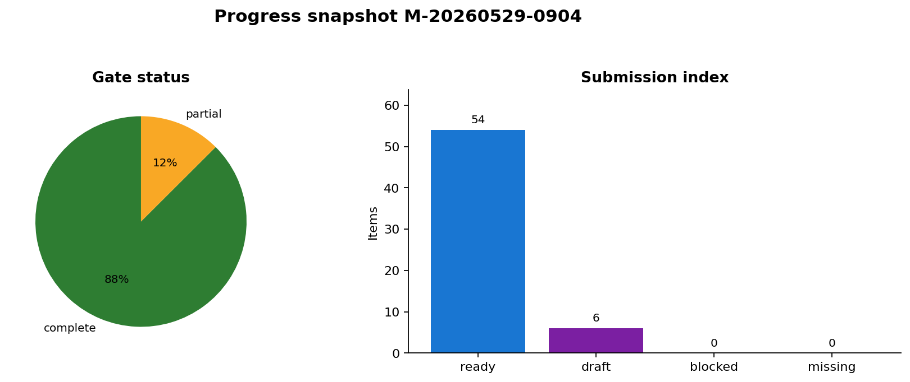
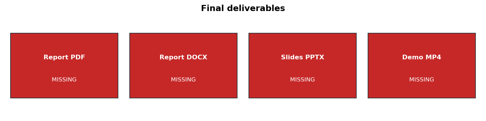
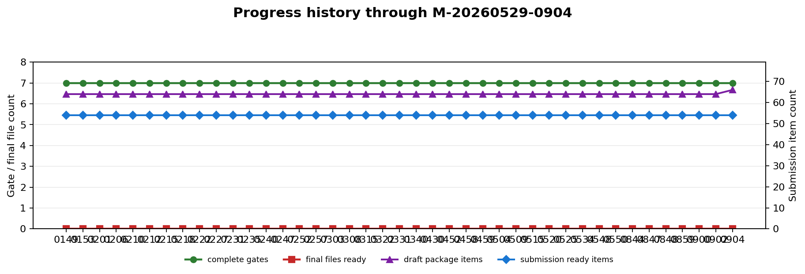
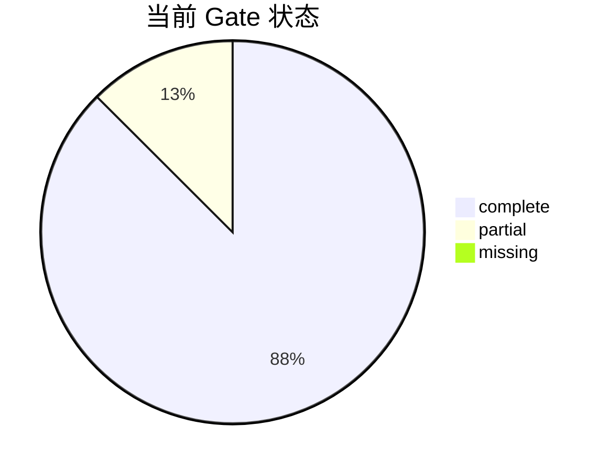
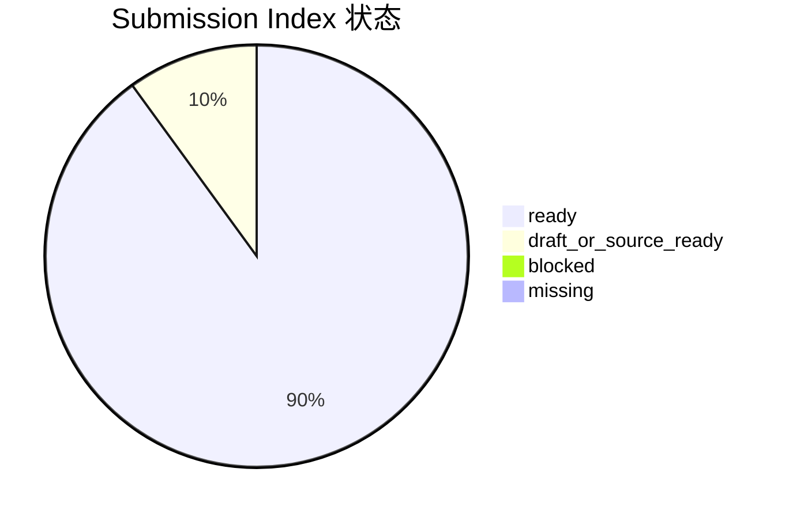
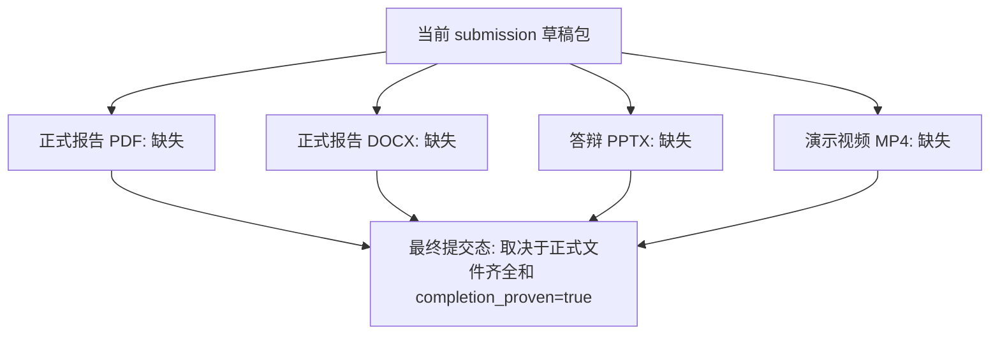

# 阶段进展汇报：赛题完成度与下一步

汇报时间：2026-05-29 09:04:27 +0800  
汇报对象：导师/组会快速阅读版  
阶段标记：`M-20260529-0904`

## 一句话结论

项目已完成主体技术链路和提交草稿结构；当前尚未达到最终提交状态。下一关键阻塞门为 `G5`，重点是正式报告/PPT/视频和剩余风险说明。

## 本阶段做了什么

| 模块 | 当前进展 | 证据入口 |
| --- | --- | --- |
| 文献与方案 | 已形成文献矩阵、技术路线、报告草稿和赛题要求矩阵 | `docs/literature_matrix.md`; `docs/solution_report_draft.md` |
| 测量布局 | 已固定 2π 上半球测量面，162 个半球面测点 | `outputs/cst_templates/sensor_layout_hemisphere_for_cst.csv` |
| Level 1 CST | required 标准源链路已完成，当前 required-now 缺失文件为 0 | `outputs/cst_level1_merge_report`; `outputs/cst_level1_reconstruction_batch` |
| Level 2 CST | 48/48 个 CST-derived element-library 样本完整，识别 accuracy 为 1.000 | `outputs/cst_level2_merge_report`; `outputs/cst_recognition_level2` |
| 项目审计 | 已生成 scorecard、completion audit、master dashboard、submission index | `outputs/scorecard`; `outputs/completion_audit`; `outputs/master_dashboard` |
| 提交草稿 | 当前 submission 草稿包 66 项已复制或生成，缺失源文件为 0 | `submission/`; `submission/submission_draft_summary.json` |

## 本次变化摘要

| 类型 | 变化/备注 |
| --- | --- |
| progress | 草稿包生成项: 64 -> 66 |
| progress | 关键文件更新：src/build_submission_draft.py: 内容已更新 |
| progress | 关键文件更新：docs/reproduce_commands.md: 内容已更新 |
| progress | 关键文件更新：submission/submission_draft_summary.json: 内容已更新 |

## 完成度图表

### 图片版总览

### Gate 状态分布

### 主线流程状态

### 提交物状态分布

### 最终交付物缺口

## 当前产物

| 产物 | 路径 | 导师可看点 |
| --- | --- | --- |
| 总控状态看板 | outputs/master_dashboard/master_status_dashboard.md | 一页看清当前 gate、阻塞点和三人任务队列。 |
| 完成度审计 | outputs/completion_audit/completion_audit.md | 保守判断哪些 gate 已完成、哪个 gate 未关闭。 |
| 赛题要求矩阵 | outputs/problem_requirements/problem_requirements_matrix.md | 将赛题要求、评分项和已有证据逐项对齐。 |
| 评分证据板 | outputs/scorecard/scorecard.md | 支撑报告/PPT 的评分项证据摘要。 |
| 提交包索引 | outputs/submission_index/submission_package_index.md | 检查报告、代码、数据、CST、附录的提交状态。 |
| 进展历史台账 | outputs/progress_report/progress_history.csv | 记录各阶段标记、Gate、提交包和最终交付物状态。 |
| 当前进展简报 | docs/progress_reports/current_progress_brief.md | 每次巡检刷新，短版回答目前做了什么、产物是什么、下一步是什么。 |
| 导师阅读门户 | docs/progress_reports/mentor_portal.md | 按阅读时间和用途导航所有导师汇报入口。 |
| 组会汇报稿 | docs/progress_reports/meeting_brief.md | 可直接用于组会口头汇报的进展、产物、风险和请求。 |
| 每日进展汇总 | docs/progress_reports/daily_digest.md | 按日期汇总阶段标记、产物演进、风险和图表。 |
| 导师证据映射 | docs/progress_reports/evidence_map.md | 把关键结论逐条映射到证据文件和当前状态。 |
| 导师决策清单 | docs/progress_reports/decision_brief.md | 集中列出当前需要导师拍板的未关闭问题。 |
| 导师问答卡 | docs/progress_reports/mentor_qa.md | 预置导师常问问题、建议回答和证据入口。 |
| G5 关闭路线 | docs/progress_reports/g5_closure_brief.md | 集中说明从当前状态到最终提交态的关闭路线和判据。 |
| G5 停滞告警 | docs/progress_reports/g5_stall_alert.md | 当 G5 多轮未关闭时，集中提示连续复核次数、责任项和关闭证据。 |
| 导师 30 秒快照 | docs/progress_reports/mentor_snapshot.md | 用最短篇幅呈现当前结论、产物、缺口和图表。 |
| 本次变化说明 | docs/progress_reports/latest_change_note.md | 单独说明最新阶段相对上一阶段变化了什么。 |
| 下一步行动清单 | docs/progress_reports/next_action_brief.md | 按负责人列出下一步任务、关闭证据和阻塞项。 |
| 风险登记表 | docs/progress_reports/risk_register.md | 集中登记当前风险、影响、负责人、缓解动作和关闭证据。 |
| 提交就绪清单 | docs/progress_reports/submission_readiness.md | 检查正式提交文件、completion 和 submission 草稿包状态。 |
| 最终交付缺口板 | docs/progress_reports/final_delivery_gap_board.md | 按最终文件倒推负责人、依赖项、关闭证据和当前状态。 |
| 阶段索引 | docs/progress_reports/progress_index.md | 按时间线汇总阶段标记、状态和导师汇报链接。 |
| 巡检范围说明 | docs/progress_reports/watch_scope.md | 说明长期跟进时监测哪些关键文件和最终交付物。 |
| 跟进操作规程 | docs/progress_reports/progress_update_protocol.md | 说明何时标记阶段、何时跳过复核、每次汇报前后要检查什么。 |
| 状态复核台账 | docs/progress_reports/status_review_log.md | 记录无变化巡检，不打扰阶段归档但保留长期跟进痕迹。 |
| 最新巡检状态卡 | docs/progress_reports/latest_status_review.md | 每次巡检都会刷新的实时状态卡，显示是否归档、最近复核和当前 G5 缺口。 |
| 草稿提交包 | submission/ | 当前可预览的最终提交目录结构。 |

## 当前风险

| 风险 | 影响 | 建议处理 |
| --- | --- | --- |
| Level 1 solver-safe 重建精度风险 | 影响标准源重建部分的可信度表达 | 复核近远场一致性、等效源基函数和正则化；必要时形成误差机理说明 |
| Level 2 full48 主要是 element-library 叠加证据 | 复杂载体结构散射/遮挡证据仍偏弱 | 补 1 到 2 个代表样本的简化结构对照，或在报告中明确适用边界 |
| 最终 PDF/DOCX/PPTX/MP4 未生成 | 不能进入最终提交态 | 在指标稳定后集中成稿并导出正式文件 |

## 下一步建议

| 优先级 | 负责人 | 动作 | 关闭证据 |
| --- | --- | --- | --- |
| 1 | A_algorithm | 处理 Level 1 solver-safe 重建精度风险。 | 报告中能解释当前 NMSE/correlation 风险，或新重建指标明显改善。 |
| 2 | B_CST | 补充 1-2 个简化载体结构散射/遮挡对照。 | 报告/PPT 中明确 full-wave/结构对照与 element-library full48 的差异或偏差范围。 |
| 3 | C_docs | 把 Level 1/2 最新结果写入正式报告、PPT 和视频脚本。 | 正式 PDF/DOCX/PPTX/MP4 文件存在，且指标与 scorecard 一致。 |
| 4 | C_docs | 最终打包前重建所有索引和提交草稿。 | completion_proven=true，submission index blocked=0，且最终文件齐全。 |

## 本次核验依据

- `outputs/master_dashboard/master_dashboard_summary.json`
- `outputs/completion_audit/completion_audit_summary.json`
- `outputs/submission_index/submission_index_summary.json`
- `submission/submission_draft_summary.json`
- `outputs/master_dashboard/master_gate_summary.csv`
- `outputs/master_dashboard/master_next_actions.csv`
- `submission/01_report`
- `submission/02_presentation`
- `submission/03_video`
