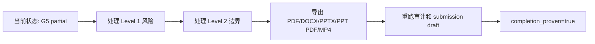

# G5 关闭路线图

更新时间：2026-05-29 12:40:12 +0800  
阶段标记：`M-20260529-124012`  
用途：集中说明从当前 G5 partial 状态到最终提交态的关闭路线、判据和复核命令。

## 当前状态

| 项目 | 当前值 |
| --- | --- |
| next_blocking_gate |  |
| completion_proven | true |
| final files ready | 5/5 |
| submission draft copied_or_generated / missing | 75 / 0 |
| submission draft is_final | false |
| submission index ready / draft-source / blocked / missing | 64 / 2 / 0 / 0 |
| ready_to_submit | false |

## 关闭路线

| 顺序 | 负责人 | 任务 | 关闭证据 | 证据入口 |
| --- | --- | --- | --- | --- |
| 1 | A_algorithm | Level 1 solver-safe 重建风险关闭 | 新重建指标改善，或报告中形成可辩护误差机理说明。 | outputs/cst_level1_reconstruction_batch; docs/solution_report_draft.md |
| 2 | A_algorithm + C_docs | Level 2 结构散射/遮挡边界关闭 | 把简化结构对照写入报告/PPT，并明确它不是 full-wave airframe scattering。 | outputs/cst_structure_comparison; docs/stage_notes/22_structure_occlusion_comparison.md |
| 3 | C_docs | 正式报告、PPT、视频成稿 | 正式 PDF/DOCX/PPTX/PPT PDF/MP4 文件存在，且指标与 scorecard 一致。 | submission/01_report; submission/02_presentation; submission/03_video |
| 4 | C_docs | 最终审计链重跑 | scorecard、需求矩阵、submission index、completion audit、master dashboard 和 submission draft 全部刷新。 | outputs/scorecard; outputs/problem_requirements; outputs/submission_index; outputs/completion_audit; outputs/master_dashboard |
| 5 | 全队 | 人工提交信息复核 | 学校、申报人、联系电话、报名表等人工信息补齐并复核。 | docs/final_submission_package_plan.md; submission/ |

## 正式交付物状态

| 最终交付物 | 路径 | 状态 |
| --- | --- | --- |
| 正式报告 PDF | submission/01_report/solution_report.pdf | 存在 |
| 正式报告 DOCX | submission/01_report/solution_report.docx | 存在 |
| 答辩 PPTX | submission/02_presentation/defense_slides.pptx | 存在 |
| 答辩 PPT PDF | submission/02_presentation/defense_slides.pdf | 存在 |
| 演示视频 MP4 | submission/03_video/demo_video.mp4 | 存在 |

## 流程图

## 复核命令

| 用途 | 命令 |
| --- | --- |
| 评分证据 | python code\build_scorecard.py |
| 赛题要求矩阵 | python code\build_problem_requirements_matrix.py |
| 提交物索引 | python code\build_submission_index.py |
| 完成度审计 | python code\build_completion_audit.py |
| 总控看板 | python code\build_master_dashboard.py |
| 阶段跟进 | python code\build_progress_report.py --note "G5 关闭状态更新" |
| 提交草稿包 | python code\build_submission_draft.py |

## 图表

## 推荐入口

| 用途 | 路径 |
| --- | --- |
| 提交就绪清单 | docs/progress_reports/submission_readiness.md |
| 导师决策清单 | docs/progress_reports/decision_brief.md |
| 导师问答卡 | docs/progress_reports/mentor_qa.md |
| 风险登记表 | docs/progress_reports/risk_register.md |
| 下一步行动清单 | docs/progress_reports/next_action_brief.md |
| 导师证据映射 | docs/progress_reports/evidence_map.md |
| 最终包计划 | docs/final_submission_package_plan.md |
