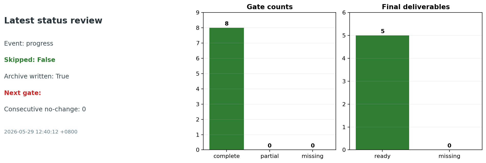
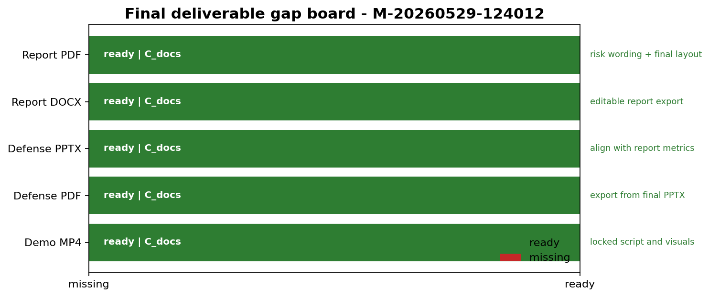

# G5 收口状态卡

更新时间：2026-05-29 12:40:12 +0800  
用途：给导师和队内负责人一个一页式 G5 收口状态说明。

## 一句话结论

当前技术 Gate 已关闭：completion_proven=true，正式交付物 5/5 已齐。剩余不是 G5 技术阻塞，而是人工播放、报名信息、最终压缩包命名，以及静默 MP4 是否需要旁白的复核。

## 告警状态

| 项目 | 当前值 |
| --- | --- |
| 本次巡检 marker | `M-20260529-124012` |
| 事件类型 | progress |
| 是否新增阶段归档 | true |
| 最新有效导师汇报 | docs/progress_reports/2026-05-29_124012_mentor_brief.md |
| completion_proven | true |
| next_blocking_gate |  |
| 同阶段无核心变化复核 | 0 次 |
| 未关闭 Gate 复核 | 无 |
| 正式交付物已存在 | 5/5 |
| 提交草稿 copied / missing / final | 75 / 0 / False |
| submission ready / draft-source / blocked / missing | 64 / 2 / 0 / 0 |
| 告警等级 | 已关闭：completion_proven=true，G5 不再是阻塞门。 |

## 为什么需要关注

| 证据 | 说明 |
| --- | --- |
| 关闭证据 | completion_proven=true；next_blocking_gate=无；最终交付物为 5/5。 |
| 后续关注 | 人工播放、报名信息、最终压缩包命名，以及静默 MP4 是否需要替换为带旁白录屏。 |
| 处理口径 | 这不是 G5 停滞告警；保留本卡作为 G5 已关闭后的最终提交复核提醒。 |

## 责任项和关闭证据

| 负责人 | 责任项 | 关闭证据 | 证据入口 |
| --- | --- | --- | --- |
| A_algorithm | Level 1 solver-safe 重建精度风险 | 报告中能解释当前 NMSE/correlation 风险，或新重建指标明显改善。 | outputs/cst_level1_reconstruction_batch |
| A_algorithm + C_docs | Level 2 结构散射/遮挡边界 | 报告/PPT 中写入简化结构遮挡对照，并明确它与 full-wave airframe scattering 的差异。 | outputs/cst_structure_comparison |
| C_docs | 正式报告、PPT、视频成稿 | 正式 PDF/DOCX/PPTX/PPT PDF/MP4 文件存在，且指标与 scorecard 一致。 | submission/ |
| 全队 | 最终审计与人工报名信息复核 | completion_proven=true，submission index blocked=0，最终文件齐全，人工信息补齐。 | outputs/completion_audit; outputs/submission_index |

## 正式交付缺口

| 最终交付物 | 路径 | 状态 |
| --- | --- | --- |
| 正式报告 PDF | submission/01_report/solution_report.pdf | 存在 |
| 正式报告 DOCX | submission/01_report/solution_report.docx | 存在 |
| 答辩 PPTX | submission/02_presentation/defense_slides.pptx | 存在 |
| 答辩 PPT PDF | submission/02_presentation/defense_slides.pdf | 存在 |
| 演示视频 MP4 | submission/03_video/demo_video.mp4 | 存在 |

## 推荐入口

| 用途 | 路径 |
| --- | --- |
| 当前进展简报 | docs/progress_reports/current_progress_brief.md |
| G5 关闭路线 | docs/progress_reports/g5_closure_brief.md |
| 风险登记表 | docs/progress_reports/risk_register.md |
| 下一步行动清单 | docs/progress_reports/next_action_brief.md |
| 提交就绪清单 | docs/progress_reports/submission_readiness.md |
| 最终交付缺口板 | docs/progress_reports/final_delivery_gap_board.md |
| 最新巡检状态卡 | docs/progress_reports/latest_status_review.md |
| 最新导师汇报 | docs/progress_reports/latest_mentor_brief.md |

## 图表

