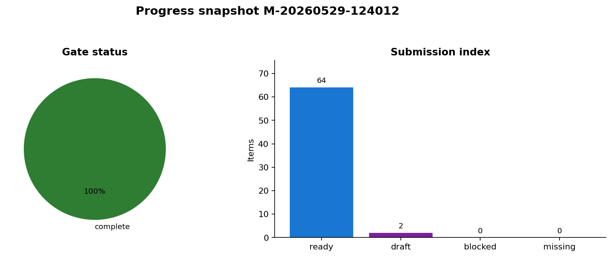
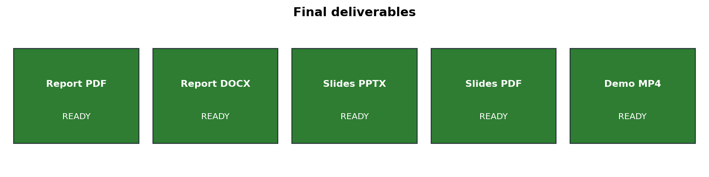
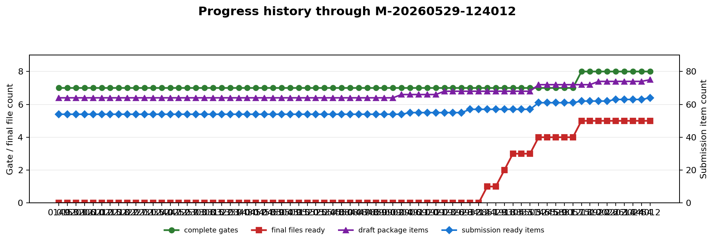

# 导师阅读入口总门户

更新时间：2026-05-29 12:40:12 +0800  
最新阶段标记：`M-20260529-124012`  
最新导师汇报：`docs/progress_reports/2026-05-29_124012_mentor_brief.md`

## 一句话结论

项目已通过 completion audit，可进入最终提交复核。

## 按时间选择入口

| 可用时间 | 建议入口 | 适合回答的问题 |
| --- | --- | --- |
| 30 秒 | docs/progress_reports/mentor_snapshot.md | 当前做到哪、能否提交、缺口是什么。 |
| 45 秒 | docs/progress_reports/current_progress_brief.md | 目前做了什么、产物是什么、下一步是什么。 |
| 1 分钟 | docs/progress_reports/latest_change_note.md | 本阶段相对上一阶段变化了什么。 |
| 2 分钟 | docs/progress_reports/next_action_brief.md | 下一步谁做、做什么、用什么证据关闭。 |
| 3 分钟 | docs/progress_reports/risk_register.md | 主要风险、影响、负责人和关闭证据。 |
| 今日复盘 | docs/progress_reports/daily_digest.md | 当天所有阶段标记、产物演进和剩余缺口。 |
| 导师拍板 | docs/progress_reports/decision_brief.md | 需要导师确认的技术取舍和最终提交策略。 |
| 导师问答 | docs/progress_reports/mentor_qa.md | 常见追问、建议回答和证据入口。 |
| G5 收口 | docs/progress_reports/g5_closure_brief.md | 最终提交态还差什么、怎么关、用什么证据关。 |
| 组会 5 分钟 | docs/progress_reports/meeting_brief.md | 可直接照着讲的阶段汇报稿。 |
| 提交前 | docs/progress_reports/submission_readiness.md | 正式 PDF/DOCX/PPTX/PPT PDF/MP4、completion 和 submission 草稿包是否就绪。 |
| 交付缺口 | docs/progress_reports/final_delivery_gap_board.md | 按 PDF/DOCX/PPTX/PPT PDF/MP4 倒推负责人、依赖和关闭证据。 |
| 完整复盘 | docs/progress_reports/progress_index.md | 所有阶段标记、时间线和归档导师汇报。 |
| 详细阅读 | docs/progress_reports/latest_mentor_brief.md | 完整导师汇报、图表、产物清单和风险。 |
| 实时巡检 | docs/progress_reports/latest_status_review.md | 最新一次巡检是否归档、是否跳过、当前 G5 状态。 |
| 产物总览 | docs/project_progress_report.md | 目前做了什么、产物是什么、下一步是什么。 |
| 巡检设置 | docs/progress_reports/watch_scope.md | 长期跟进监测哪些关键文件和最终交付物。 |
| 跟进规程 | docs/progress_reports/progress_update_protocol.md | 何时标记阶段、何时跳过复核、每次汇报要检查什么。 |
| 复核台账 | docs/progress_reports/status_review_log.md | 无变化巡检记录，确认没有把状态复核误写成阶段归档。 |

## 当前状态

| 项目 | 当前值 |
| --- | --- |
| 阶段标记 | `M-20260529-124012` |
| 完成度证明 | true |
| 下一阻塞门 |  |
| Gate 完成 / 部分 / 缺失 | 8 / 0 / 0 |
| Submission ready / draft-source / blocked / missing | 64 / 2 / 0 / 0 |
| 草稿包 copied_or_generated / missing | 75 / 0 |
| 正式交付物已存在 | 5/5 |
| 历史台账记录 | 70 条 |
| 归档导师汇报 | 74 份，其中 archive-only 4 份 |

## 最新图表

## 固定入口清单

| 入口 | 路径 |
| --- | --- |
| 导师阅读门户 | docs/progress_reports/mentor_portal.md |
| 当前进展简报 | docs/progress_reports/current_progress_brief.md |
| 组会汇报稿 | docs/progress_reports/meeting_brief.md |
| 每日进展汇总 | docs/progress_reports/daily_digest.md |
| 导师证据映射 | docs/progress_reports/evidence_map.md |
| 导师决策清单 | docs/progress_reports/decision_brief.md |
| 导师问答卡 | docs/progress_reports/mentor_qa.md |
| G5 关闭路线 | docs/progress_reports/g5_closure_brief.md |
| 导师 30 秒快照 | docs/progress_reports/mentor_snapshot.md |
| 本次变化说明 | docs/progress_reports/latest_change_note.md |
| 下一步行动清单 | docs/progress_reports/next_action_brief.md |
| 风险登记表 | docs/progress_reports/risk_register.md |
| 提交就绪清单 | docs/progress_reports/submission_readiness.md |
| 最终交付缺口板 | docs/progress_reports/final_delivery_gap_board.md |
| 最新导师汇报 | docs/progress_reports/latest_mentor_brief.md |
| 阶段索引 | docs/progress_reports/progress_index.md |
| 巡检范围 | docs/progress_reports/watch_scope.md |
| 跟进操作规程 | docs/progress_reports/progress_update_protocol.md |
| 状态复核台账 | docs/progress_reports/status_review_log.md |
| 最新巡检状态卡 | docs/progress_reports/latest_status_review.md |
| 状态复核 CSV | outputs/progress_report/status_review_log.csv |
| 历史台账 CSV | outputs/progress_report/progress_history.csv |
